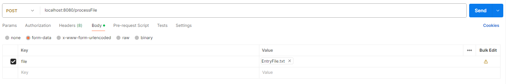

## Overview
This application is a Spring Boot service that processes files. The processing is done by calling the `/processFile` endpoint with a file as a form data.

Note: logs are saved into a H2 database

Run service using `FileServiceApplication.java`

## Application Properties
The application uses two properties files: `application.properties` and `validation.properties`.

### application.properties
This file is used to configure the Spring Boot application. It can include server port, context path, database configurations, etc. It is located in the `src/main/resources` directory.

### validation.properties
This file is used to configure the blocked countries and ISPs for the IP validation. It is located in the `src/main/resources` directory. The properties are as follows:

- `blocked.countries`: A comma-separated list of country names that are blocked. For example: `US,CA`
- `blocked.isps`: A comma-separated list of ISP names that are blocked. For example: `ISP1,ISP2`

Note: property file used because you won't need to restart the service to update the list vs hard coded (better if spring cloud config can be used here)

## Test Data

Sample data in the resources folder : `BadFile.txt, EmptyFile.txt, EmptyFieldFile.txt`

## Endpoint Usage

The application exposes an endpoint for file processing. The endpoint is used as follows:

- Endpoint: `/processFile`
- Method: `POST`
- Form Data: `file` - The file to be processed.

Example usage with curl:

```bash
curl -X POST -F "file=@path_to_your_file" http://localhost:8080/processFile
```

Or using Postman:

1. Open Postman
2. Select `POST` method
3. Enter the URL `http://localhost:8080/processFile`
4. In the `Body` tab, select `form-data`
5. Enter `file` as the key
6. Select `File` from the dropdown menu
7. Choose your file
8. Click `Send`

Postman


## Responses
200 - file processed ok

403 - if the request is blocked `Your IP is blocked due to country or ISP restrictions`

400 - if we can not validate the ip.

## Result
This will return a string indicating the outcome of the file processing, in a file in the main directory and returned as a JSON response

```
OutcomeFile:
Type: JSON
Name: OutcomeFile.json (main directory)

Content Structure:
Name, Transport, Top Speed
```

## Exception Handling
In case of an empty file or an error during processing, the application throws a general `Exception` with a message indicating the error, also logged in INFO
